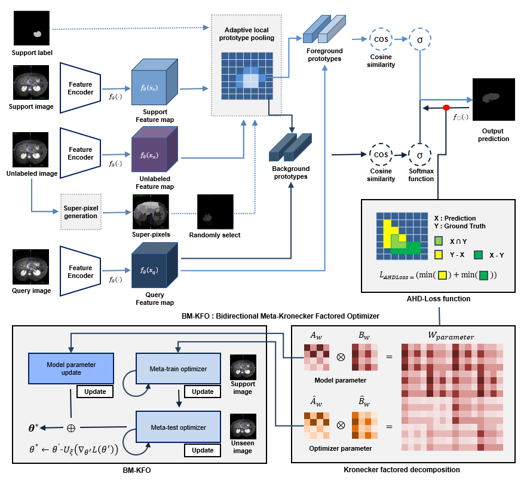

# BMKFO

[Preprint] [Bidirectional Meta-Kronecker Factored Optimizer and Hausdorff Distance Loss for Few-shot Medical Image Segmentation](https://www.researchsquare.com/article/rs-2324435/v1)

<p align="center">
    <a href="#-Overall-architecture"> 🔍 Overall architecture</a> •
    <a href="#-Quick-Start"> 🛵 Quick Start</a> •
    <a href="#-Papers"> 📜 Papers</a> •
    <a href="#-Acknowledgement">📌Acknowledgement</a>
</p>

### 🔍 Overall architecture



**Abstract**:

To increase the accuracy of medical image analysis using supervised learning-based AI technology, a large amount of accurately labeled training data is required.
However, the supervised learning approach may not be applicable to real-world medical imaging due to the lack of labeled data, the privacy of patients, and the cost of specialized knowledge.
To handle these issues, we utilized Kronecker-factored decomposition, which enhances both computational efficiency and stability of the learning process. 
We combined this approach with a model-agnostic meta-learning (MAML) framework for the parameter optimization.
Based on this method, we present a Bidirectional Meta-Kronecker Factored Optimizer (BM-KFO) framework to quickly optimize semantic segmentation tasks using just a few Magnetic Resonance Imaging (MRI) images as input.
This model-agnostic approach can be implemented without altering network components and is capable of learning the learning process and meta-initial points while training on previously unseen data.
We also incorporated a combination of average Hausdorff distance loss (AHD-Loss) and cross-entropy loss into our objective function to specifically target the morphology of organs or lesions in medical images.
Through evaluation of the proposed method on the abdominal MRI dataset, we obtained an average performance of 78.07\% in setting 1 and 79.85\% in setting 2.
Our experiments demonstrate that BM-KFO with AHD-Loss is suitable for general medical image segmentation applications and achieves superior performance compared to the baseline method in few-shot learning tasks.

### 🛵 Quick Start

To get started, please first setup the environment:

```bash
dcm2nii
json5==0.8.5
jupyter==1.0.0
nibabel==2.5.1
numpy==1.15.1
opencv-python==4.1.1.26
Pillow==7.1.0 
sacred==0.7.5
scikit-image==0.14.0
SimpleITK==1.2.3
torch==1.3.0
torchvision==0.4.1
```
### ⚙️ Installation
#### 1. Data pre-processing

Installation

### 📜 Papers

Papers

**Bidirectional Meta-Kronecker factored optimizer**


### 📌 Acknowledgement

Acknowledgement
